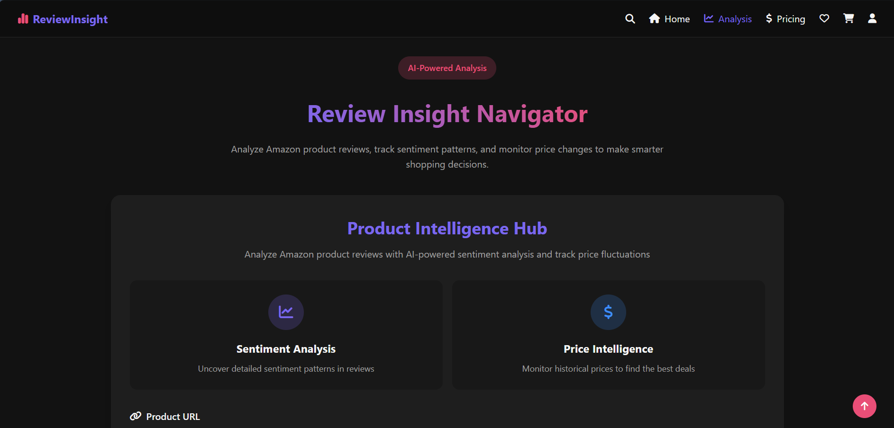
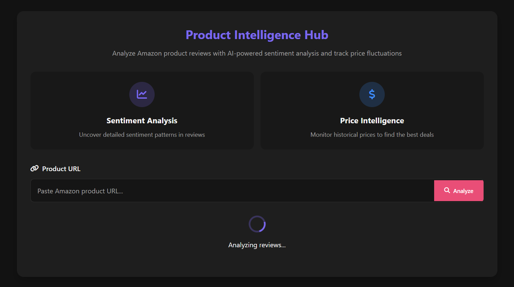
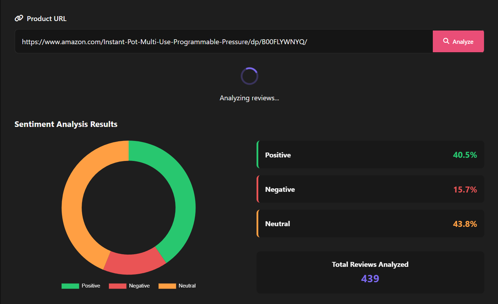

# Review Insight Analyzer

## 1. Introduction

Review Insight Analyzer is a web application that empowers users to make informed purchasing decisions by analyzing product reviews from Amazon. By simply pasting a product URL, users can quickly visualize sentiment patterns across hundreds of customer reviews, understanding the overall reception of a product without having to read through every review manually.

The application provides a visual breakdown of positive, negative, and neutral sentiments expressed in reviews, helping users identify potential issues or strengths of products before making a purchase. This tool is particularly valuable in today's e-commerce landscape where product listings often have hundreds or thousands of reviews that would be impossible to manually process.

## 2. Understanding the Technology

### What is Sentiment Analysis?

Sentiment Analysis (also known as opinion mining) is a natural language processing (NLP) technique used to determine the emotional tone behind a series of words. It helps businesses and individuals understand the social sentiment of their brand, product, or service by analyzing text data.

In the context of this application:
- Sentiment analysis algorithms classify product reviews as positive, negative, or neutral
- The classification is based on the language, tone, and context within each review
- Machine learning models are trained to recognize patterns in language that indicate sentiment
- The aggregate analysis provides a quantitative overview of customer opinions

### What is BeautifulSoup4?

BeautifulSoup4 is a Python library designed for web scraping purposes. It creates a parse tree from page source code that can be used to extract data from HTML, which is particularly useful for web scraping operations.

In this project, BeautifulSoup4 is used to:
- Parse the HTML of Amazon product pages
- Navigate the DOM structure to locate customer review sections
- Extract review text, ratings, and other relevant metadata
- Clean and prepare the data for sentiment analysis

## 3. Features

- **Intuitive User Interface**: Clean, dark-themed UI with clear navigation and responsive design
- **URL-Based Analysis**: Simply paste an Amazon product URL to begin analysis
- **Visual Sentiment Breakdown**: 
  - Doughnut chart visualization of positive, negative, and neutral reviews
  - Percentage-based breakdown for quick assessment
  - Total review count to understand sample size
- **AI-Powered Analysis**: Advanced sentiment analysis algorithms to accurately categorize reviews
- **Cross-Device Compatibility**: Fully responsive design that works on desktop, tablet, and mobile devices
- **Real-Time Processing**: Quick analysis with visual loading indicators
- **Error Handling**: Clear feedback when issues arise with URL processing

## 4. Installation and Usage

### Prerequisites
- Python 3.7 or higher
- pip (Python package installer)

### Installation

1. Clone the repository:
   ```
   git clone https://github.com/Abbas1608/Mini-Project.git
   ```

2. Create a virtual environment:
   ```
   python -m venv venv
   ```

3. Activate the virtual environment:
   - On Windows:
     ```
     venv\Scripts\activate
     ```
   - On macOS/Linux:
     ```
     source venv/bin/activate
     ```

4. Install the required dependencies:
   ```
   pip install -r requirements.txt
   python -m textblob.download_corpora
   ```

### Usage

1. Start the Flask server:
   ```
   python app.py
   ```
2. Enter an Amazon product URL in the input field.

3. Click "Analyze" and wait for the results to appear.

4. Review the sentiment analysis results shown in the chart and percentage breakdown.

### What is a Virtual Environment?

A virtual environment is an isolated Python environment that allows you to install packages for a specific project without affecting your global Python installation. Benefits include:

- **Dependency Isolation**: Each project can have its own dependencies, regardless of what dependencies every other project has.
- **Version Control**: You can use different versions of the same package for different projects.
- **Clean Testing Environment**: Ensures your application runs with only the packages it needs.
- **Easy Requirement Sharing**: The `requirements.txt` file makes it simple to recreate the same environment on another machine.

In this project, the virtual environment isolates the Flask, BeautifulSoup4, and other dependencies to ensure compatibility and prevent conflicts with other Python projects.

## 5. Project Workflow

```mermaid
graph TD
    A[User enters Amazon product URL] --> B[Flask backend receives URL]
    B --> C{URL valid?}
    C -->|No| D[Return error message]
    C -->|Yes| E[Fetch product page using Requests]
    E --> F[Parse HTML with BeautifulSoup4]
    F --> G[Extract product reviews]
    G --> H[Perform sentiment analysis on each review]
    H --> I[Calculate percentage of positive, negative, neutral]
    I --> J[Return analysis results to frontend]
    J --> K[Display results as chart and percentages]
    
    style A fill:#f9d77e,stroke:#000,stroke-width:2px,color:#000
    style B fill:#a8d1df,stroke:#333,stroke-width:2px,color:#000
    style C fill:#ffa5a5,stroke:#333,stroke-width:2px,color:#000
    style D fill:#ff8080,stroke:#333,stroke-width:2px,color:#000
    style E fill:#a8d1df,stroke:#333,stroke-width:2px,color:#000
    style F fill:#a8d1df,stroke:#333,stroke-width:2px,color:#000
    style G fill:#a8d1df,stroke:#333,stroke-width:2px,color:#000
    style H fill:#c3e6cb,stroke:#333,stroke-width:2px,color:#000
    style I fill:#c3e6cb,stroke:#333,stroke-width:2px,color:#000
    style J fill:#a8d1df,stroke:#333,stroke-width:2px,color:#000
    style K fill:#f9d77e,stroke:#333,stroke-width:2px,color:#000

```
## UI Design 



## Input TextBox



## Output 


## 6. Conclusion

Review Insight Analyzer provides a powerful solution to the challenge of navigating the overwhelming volume of customer reviews in modern e-commerce. By leveraging natural language processing and sentiment analysis, it transforms raw textual data into actionable insights that guide purchasing decisions.

This tool demonstrates the practical application of web scraping, data processing, and machine learning techniques to solve a common problem faced by online shoppers. The intuitive visualization of sentiment patterns helps users quickly understand the overall reception of products, highlighting potential issues or confirming quality before purchase.

As e-commerce continues to grow, tools like Review Insight Analyzer become increasingly valuable in helping consumers make informed decisions amid the noise of countless reviews and marketing messages.

Future enhancements could include:
- Keyword extraction to identify commonly mentioned product features
- Time-based analysis to track sentiment changes over product lifetime
- Comparative analysis between similar products
- Browser extension for seamless integration with shopping experience

---

**Note**: This demonstration version uses simulated data. For production use, ensure compliance with Amazon's terms of service regarding web scraping or consider using their official API if available.
